# Integración de Agentes AI para Aplicar Correcciones Automáticas

> **Última actualización:** 2025-11-17  
> **Versión:** 2.0.0  
> **Sistema:** Wincova - Correcciones Automáticas

---

## 📚 Documentación Relacionada

- **Documentación Completa:** [SISTEMA_CORRECCIONES_AUTOMATICAS.md](./SISTEMA_CORRECCIONES_AUTOMATICAS.md)
- **Guía Rápida:** [QUICK_START_CORRECCIONES.md](./QUICK_START_CORRECCIONES.md)
- **Flujo Visual:** [FLUJO_VISUAL_CORRECCIONES.md](./FLUJO_VISUAL_CORRECCIONES.md)

---

Este documento explica cómo **cualquier agente AI** (Lovable, Replit, Claude, GPT, Cursor, etc.) puede leer y aplicar automáticamente las correcciones aprobadas en el sistema.

## 🎯 Objetivo

Permitir que diferentes agentes AI puedan:
1. Leer correcciones aprobadas desde una API
2. Aplicarlas automáticamente al código
3. Marcarlas como aplicadas en el sistema

## 📡 Endpoints Disponibles

### 1. Obtener Correcciones Aprobadas

**Endpoint:** `GET /functions/v1/get-approved-corrections`

**Respuesta:**
```json
{
  "total_corrections": 4,
  "instructions_for_ai": "You are an AI agent tasked with applying code corrections...",
  "corrections": [
    {
      "correction_id": "uuid-here",
      "severity": "critical",
      "file": "src/pages/AdminCorrections.tsx",
      "line": 164,
      "issue": "Falta de manejo de errores",
      "description": "No se observa un manejo de errores...",
      "current_code": "const { error } = await supabase...",
      "suggested_code": "const { error } = await supabase... if (error) { toast({ title: 'Error'... }) }",
      "notes": "Agregar try-catch",
      "action_required": "Replace the code at line 164 in src/pages/AdminCorrections.tsx"
    }
  ]
}
```

### 2. Marcar Correcciones como Aplicadas

**Endpoint:** `POST /functions/v1/mark-corrections-applied`

**Body:**
```json
{
  "correction_ids": ["uuid-1", "uuid-2", "uuid-3"]
}
```

**Respuesta:**
```json
{
  "success": true,
  "applied_count": 3,
  "corrections": [
    { "id": "uuid-1", "file_path": "src/...", "issue_title": "..." }
  ]
}
```

## 🤖 Cómo Usar desde Diferentes Agentes

### Lovable AI (Este Chat)

```
Usuario: "Lee y aplica todas las correcciones aprobadas"

Lovable AI:
1. Llama a GET /functions/v1/get-approved-corrections
2. Lee cada corrección
3. Modifica los archivos usando lov-line-replace
4. Llama a POST /functions/v1/mark-corrections-applied con los IDs
```

### Replit AI

```python
import requests

# 1. Obtener correcciones
response = requests.get("https://your-project.supabase.co/functions/v1/get-approved-corrections")
corrections = response.json()

applied_ids = []
for correction in corrections['corrections']:
    # 2. Aplicar corrección
    file_path = correction['file']
    with open(file_path, 'r') as f:
        content = f.read()
    
    # Reemplazar código
    content = content.replace(
        correction['current_code'], 
        correction['suggested_code']
    )
    
    with open(file_path, 'w') as f:
        f.write(content)
    
    applied_ids.append(correction['correction_id'])

# 3. Marcar como aplicadas
requests.post(
    "https://your-project.supabase.co/functions/v1/mark-corrections-applied",
    json={"correction_ids": applied_ids}
)
```

### Claude AI / GPT-4 / ChatGPT

```
Prompt para el agente:

"Necesito que actúes como un agente de corrección de código. 

1. Primero, llama a esta API para obtener correcciones:
   GET https://ghbksqyioendvispcseu.supabase.co/functions/v1/get-approved-corrections

2. Lee cada corrección en el JSON devuelto

3. Para cada corrección:
   - Abre el archivo especificado en 'file'
   - Navega a la línea 'line'
   - Reemplaza 'current_code' con 'suggested_code'
   - Verifica que el cambio tiene sentido

4. Después de aplicar TODAS las correcciones, llama a:
   POST https://ghbksqyioendvispcseu.supabase.co/functions/v1/mark-corrections-applied
   Body: { "correction_ids": ["id1", "id2", ...] }

5. Confirma cuántas correcciones aplicaste exitosamente"
```

### Cursor AI

```javascript
// En el archivo .cursorrules o como prompt al agente

const applyCorrections = async () => {
  // 1. Fetch corrections
  const response = await fetch(
    'https://ghbksqyioendvispcseu.supabase.co/functions/v1/get-approved-corrections'
  );
  const data = await response.json();
  
  const appliedIds = [];
  
  // 2. Apply each correction
  for (const correction of data.corrections) {
    const { file, current_code, suggested_code, correction_id } = correction;
    
    // Read file, replace code, write file
    // ... (implementation depends on Cursor's file API)
    
    appliedIds.push(correction_id);
  }
  
  // 3. Mark as applied
  await fetch(
    'https://ghbksqyioendvispcseu.supabase.co/functions/v1/mark-corrections-applied',
    {
      method: 'POST',
      headers: { 'Content-Type': 'application/json' },
      body: JSON.stringify({ correction_ids: appliedIds })
    }
  );
  
  console.log(`Applied ${appliedIds.length} corrections`);
};
```

## 🔒 Seguridad

- Las funciones están públicas (`verify_jwt = false`) para permitir acceso desde cualquier agente
- **Recomendación:** Agregar autenticación con API key si es necesario
- Los agentes deben tener permisos de escritura en el repositorio

## 🎬 Flujo Completo

```mermaid
graph TD
    A[Admin aprueba correcciones] --> B[Correcciones quedan en estado 'approved']
    B --> C[Agente AI llama GET /get-approved-corrections]
    C --> D[Agente lee JSON con instrucciones]
    D --> E[Agente aplica cambios al código]
    E --> F[Agente llama POST /mark-corrections-applied]
    F --> G[Correcciones marcadas como 'applied']
```



## 📝 Ejemplo de Prompt Universal

Puedes copiar y pegar esto a cualquier agente AI:

```
Lee las correcciones aprobadas desde:
https://ghbksqyioendvispcseu.supabase.co/functions/v1/get-approved-corrections

Aplica cada corrección reemplazando el código indicado en los archivos.

Después, marca las correcciones como aplicadas enviando los IDs a:
POST https://ghbksqyioendvispcseu.supabase.co/functions/v1/mark-corrections-applied
Body: { "correction_ids": ["id1", "id2", ...] }

Reporta cuántas correcciones aplicaste exitosamente.
```

## 🔗 URLs del Proyecto

- **Base URL:** `https://ghbksqyioendvispcseu.supabase.co`
- **Get Corrections:** `/functions/v1/get-approved-corrections`
- **Mark Applied:** `/functions/v1/mark-corrections-applied`

---

**Nota:** Este sistema es completamente agnóstico del agente AI que lo use. Funciona con cualquier herramienta que pueda hacer llamadas HTTP y modificar archivos.
