# Flujo Visual del Sistema de Correcciones Automáticas

## 🎨 Diagrama de Flujo Completo

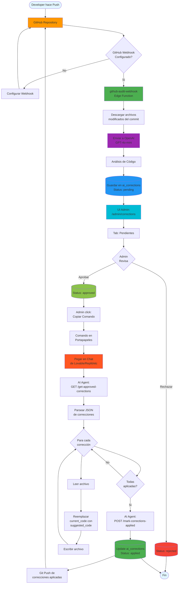

---

## 🔄 Ciclo Completo en Detalle

### Fase 1: Detección Automática (0-60 segundos)

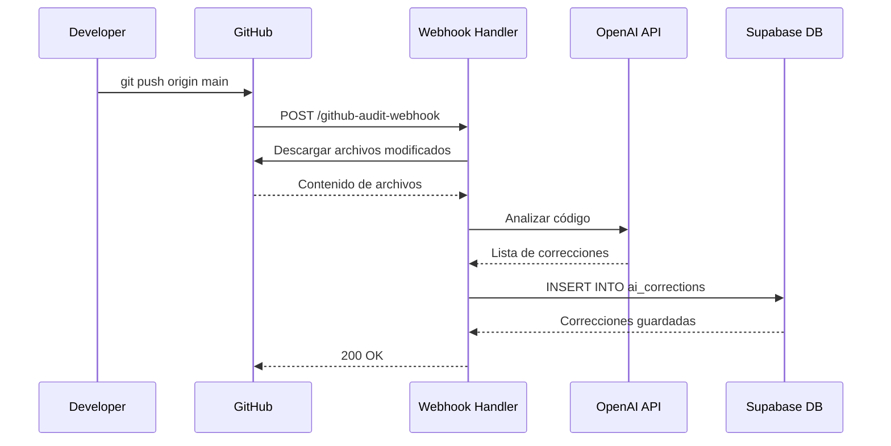

**Tiempo estimado:** 30-60 segundos

---

### Fase 2: Revisión Manual (Tiempo variable)

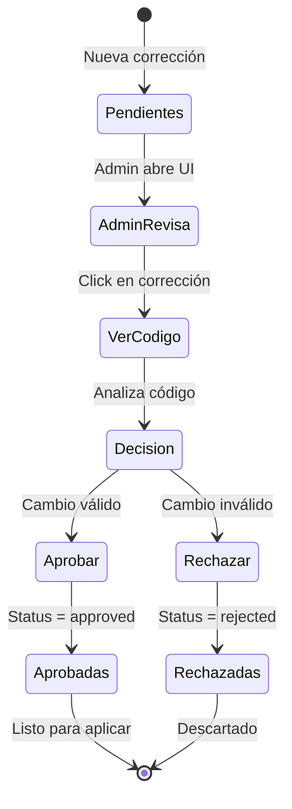

**Tiempo estimado:** 1-5 minutos por corrección

---

### Fase 3: Aplicación Automática (1-2 minutos)

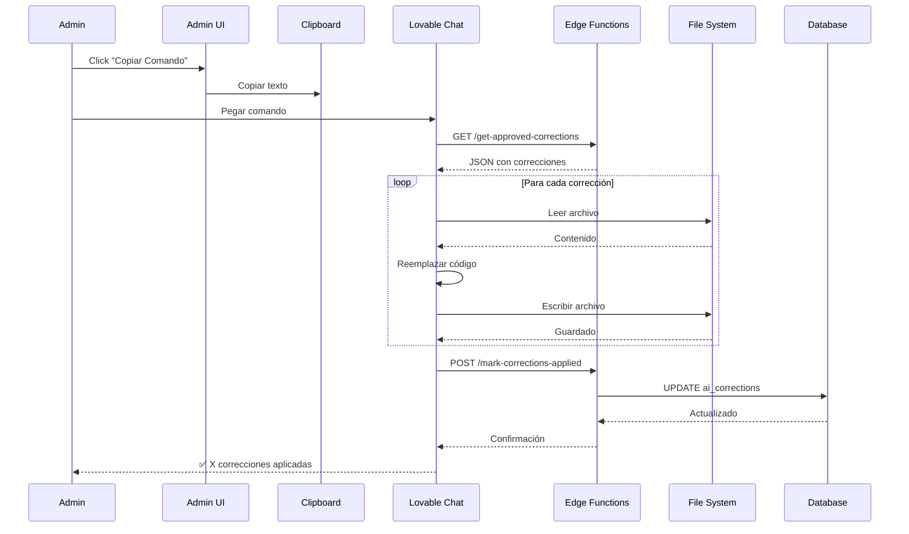

**Tiempo estimado:** 1-2 minutos para 10-20 correcciones

---

## 📊 Estados y Transiciones

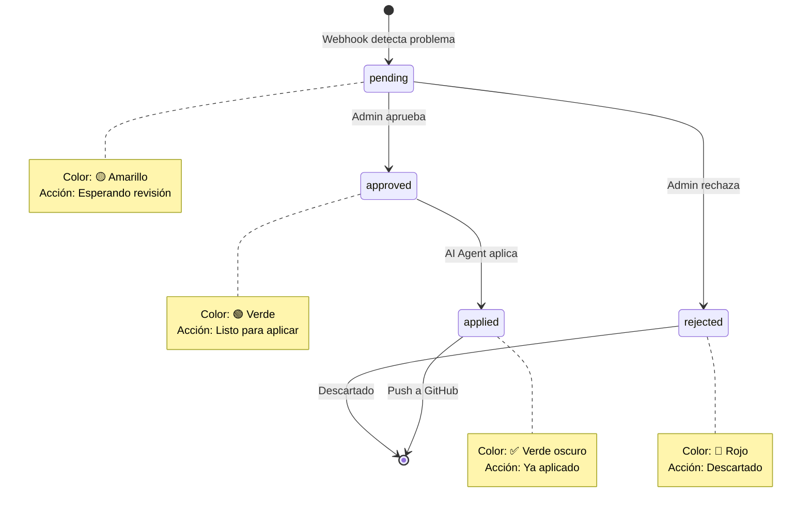

---

## 🎯 Puntos de Decisión

### ¿Cuándo aprobar una corrección?

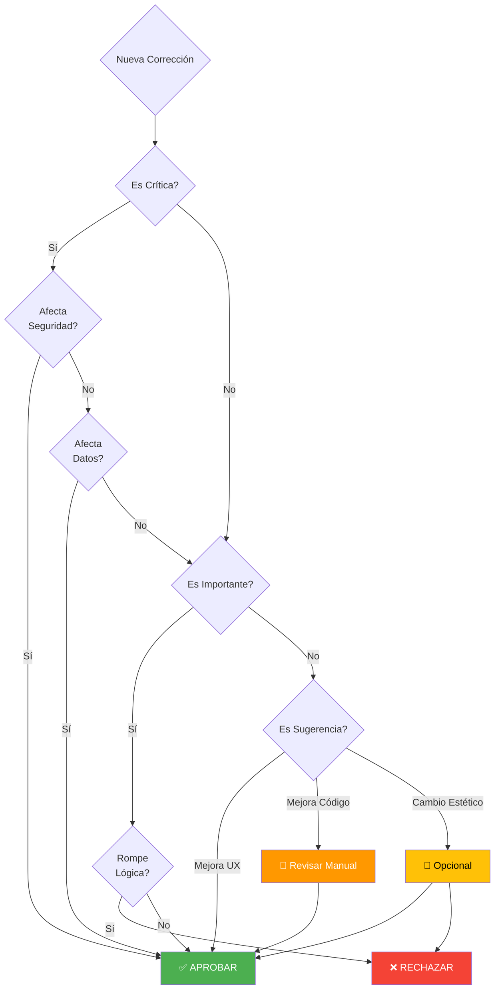

---

## 🚦 Semáforo de Severidad

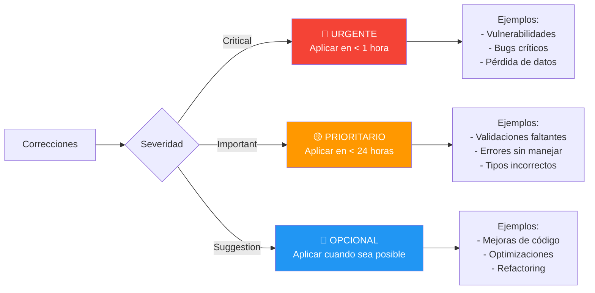

---

## 📈 Métricas del Sistema

### Dashboard Visual

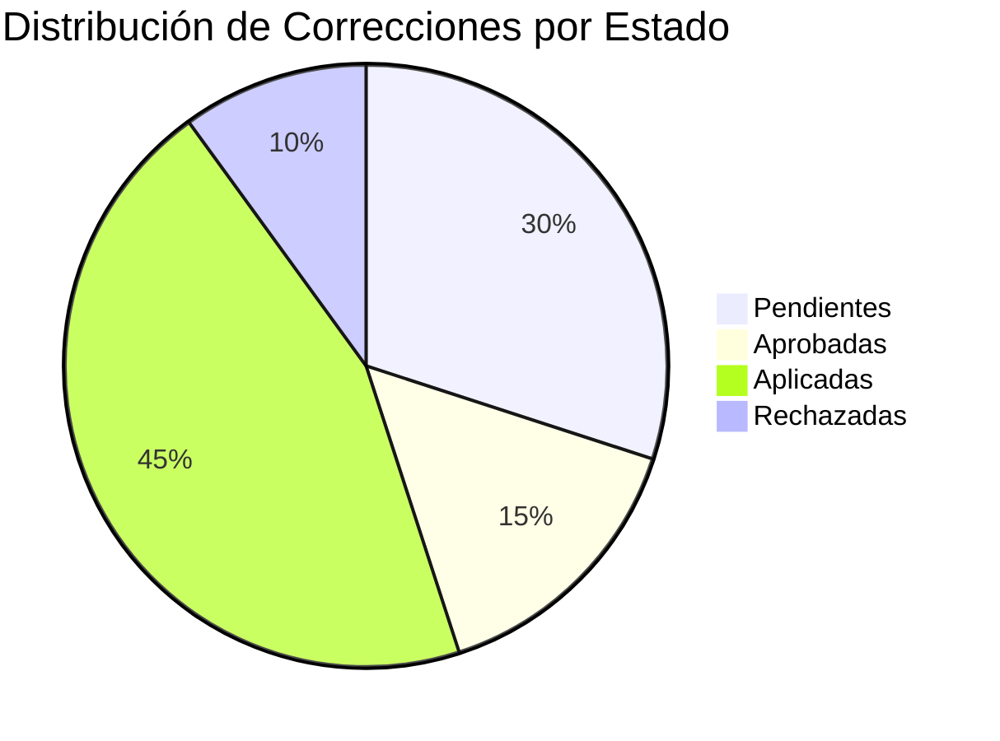

### Embudo de Conversión

```mermaid
funnel
    title Embudo de Correcciones
    "Detectadas (100)" : 100
    "Revisadas (80)" : 80
    "Aprobadas (60)" : 60
    "Aplicadas (55)" : 55
```

---

## 🔄 Flujo de Rollback

### Si una corrección rompe algo:

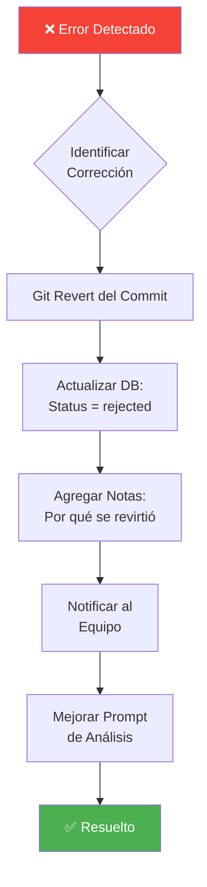

---

## 🎨 Interfaz de Usuario

### Vista de Corrección Individual

```
┌─────────────────────────────────────────────────────────┐
│ 🔴 Falta de manejo de errores en fetchCorrections       │
├─────────────────────────────────────────────────────────┤
│ src/pages/AdminCorrections.tsx : Línea 36               │
├─────────────────────────────────────────────────────────┤
│ La función fetchCorrections no tiene manejo de errores, │
│ lo que puede causar que la aplicación falle...          │
├─────────────────────────────────────────────────────────┤
│ Código Actual:                                           │
│ ┌─────────────────────────────────────────────────────┐ │
│ │ const fetchCorrections = async () => {              │ │
│ │   const { data, error } = await supabase            │ │
│ │     .from('ai_corrections')                         │ │
│ │     .select('*')                                    │ │
│ │ }                                                   │ │
│ └─────────────────────────────────────────────────────┘ │
├─────────────────────────────────────────────────────────┤
│ Código Sugerido:                                         │
│ ┌─────────────────────────────────────────────────────┐ │
│ │ const fetchCorrections = async () => {              │ │
│ │   try {                                             │ │
│ │     const { data, error } = await supabase          │ │
│ │       .from('ai_corrections')                       │ │
│ │       .select('*')                                  │ │
│ │     if (error) throw error                          │ │
│ │   } catch (error) {                                 │ │
│ │     toast({ title: 'Error', description: '...' })   │ │
│ │   }                                                 │ │
│ │ }                                                   │ │
│ └─────────────────────────────────────────────────────┘ │
├─────────────────────────────────────────────────────────┤
│  [Aprobar]  [Rechazar]  [Copiar]                        │
└─────────────────────────────────────────────────────────┘
```

---

## 🎬 Timeline de Eventos

```mermaid
gantt
    title Timeline Típico de una Corrección
    dateFormat  HH:mm:ss
    
    section Detección
    Push a GitHub       :a1, 00:00:00, 5s
    Webhook triggered   :a2, after a1, 5s
    OpenAI Analysis     :a3, after a2, 30s
    Save to DB          :a4, after a3, 5s
    
    section Revisión
    Admin abre UI       :b1, after a4, 60s
    Revisa corrección   :b2, after b1, 120s
    Aprueba             :b3, after b2, 10s
    
    section Aplicación
    Copia comando       :c1, after b3, 5s
    Pega en chat        :c2, after c1, 10s
    AI aplica cambios   :c3, after c2, 60s
    Marca como aplicada :c4, after c3, 5s
```

---

## 🔗 Arquitectura de Integración

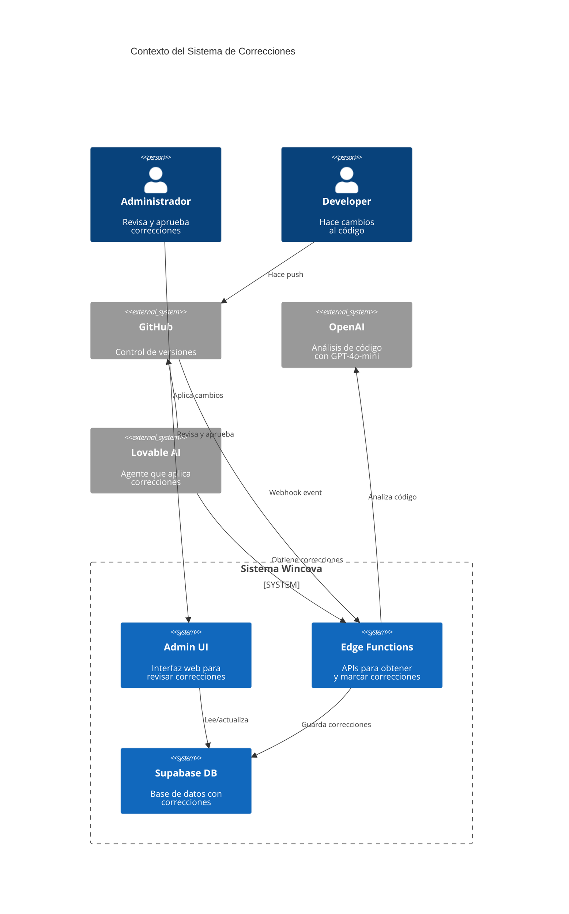

---

## 📱 Responsive Flow

### Desktop View

```
┌─────────────────────────────────────────────────────────────┐
│  Correcciones AI                                             │
├─────────────────────────────────────────────────────────────┤
│  [Pendientes (16)] [Aprobadas (0)] [Rechazadas (0)] [...] │
├─────────────────────────────────────────────────────────────┤
│  ┌───────────────────────────────────────────────────────┐  │
│  │ 🔴 Corrección 1                      [Aprobar][...]  │  │
│  └───────────────────────────────────────────────────────┘  │
│  ┌───────────────────────────────────────────────────────┐  │
│  │ 🟡 Corrección 2                      [Aprobar][...]  │  │
│  └───────────────────────────────────────────────────────┘  │
└─────────────────────────────────────────────────────────────┘
```

### Mobile View

```
┌────────────────┐
│ Correcciones AI│
├────────────────┤
│ [☰] Tabs       │
├────────────────┤
│ ┌────────────┐ │
│ │ 🔴 Corr. 1 │ │
│ │ [Ver más]  │ │
│ └────────────┘ │
│ ┌────────────┐ │
│ │ 🟡 Corr. 2 │ │
│ │ [Ver más]  │ │
│ └────────────┘ │
└────────────────┘
```

---

**Última actualización:** 2025-11-17  
**Versión:** 1.0.0  
**Tipo:** Documentación Visual
