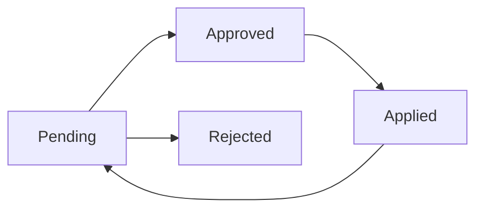

# Guía de Inicio Rápido - Sistema de Correcciones Automáticas

## 🚀 En 5 Minutos

### Para Administradores

#### 1. Acceder al Sistema (30 segundos)
```
1. Abre tu navegador
2. Ve a: /admin/corrections
3. Verás 4 tabs: Pendientes, Aprobadas, Rechazadas, Aplicadas
```

#### 2. Revisar Correcciones (2 minutos)
```
1. Click en tab "Pendientes (X)"
2. Verás una lista de correcciones con:
   - 🔴 CRITICAL (rojo)
   - 🟡 IMPORTANT (amarillo)
   - 🔵 SUGGESTION (azul)

3. Cada corrección muestra:
   - Título del problema
   - Archivo afectado
   - Código actual vs sugerido
```

#### 3. Aprobar Corrección (1 minuto)
```
1. Click en botón "Aprobar" (verde)
2. Se abre diálogo
3. [Opcional] Agrega notas
4. Click "Aprobar" en el diálogo
5. ✅ Corrección movida a "Aprobadas"
```

#### 4. Aplicar Correcciones (1 minuto)
```
1. Click en botón rojo "Copiar Comando para Aplicar X Correcciones"
2. Verás toast verde: "✅ Comando copiado"
3. Abre chat de Lovable (este chat)
4. Pega (Ctrl+V / Cmd+V)
5. Envía
6. ✨ Correcciones se aplican automáticamente
```

---

## 📝 Comandos Rápidos

### Para copiar y pegar en Lovable:

**Aplicar correcciones aprobadas:**
```
Aplica automáticamente las correcciones aprobadas. Lee la API GET /functions/v1/get-approved-corrections, aplica cada corrección al código usando lov-line-replace, y marca como aplicadas llamando a POST /functions/v1/mark-corrections-applied con los IDs.
```

**Ver correcciones en formato JSON:**
```
Llama a GET https://ghbksqyioendvispcseu.supabase.co/functions/v1/get-approved-corrections y muéstrame el JSON completo
```

---

## 🎯 Casos de Uso Comunes

### Caso 1: Primera vez usando el sistema

```
1. Acabas de configurar el webhook de GitHub
2. Haces tu primer push
3. Esperas 30 segundos
4. Vas a /admin/corrections
5. Verás correcciones automáticas
6. Apruebas las que quieras
7. Aplicas con un solo click
```

### Caso 2: Muchas correcciones pendientes

```
1. Tienes 50 correcciones pendientes
2. Filtras por "CRITICAL" primero
3. Click en "Aprobar Todas" para críticas
4. Luego filtras "IMPORTANT"
5. Apruebas manualmente las importantes
6. Ignoras las "SUGGESTION" por ahora
7. Aplicas todas las aprobadas de una vez
```

### Caso 3: Rechazar corrección incorrecta

```
1. Ves una corrección que no tiene sentido
2. Click en "Rechazar" (rojo)
3. Agrega nota: "Esta corrección rompe la lógica de negocio"
4. Click "Rechazar" en el diálogo
5. ✅ Corrección movida a "Rechazadas"
```

---

## 🔥 Atajos de Teclado

| Acción | Atajo |
|--------|-------|
| Ver tab Pendientes | `1` |
| Ver tab Aprobadas | `2` |
| Ver tab Rechazadas | `3` |
| Ver tab Aplicadas | `4` |
| Copiar comando | `Ctrl+Shift+C` |

---

## ⚡ Tips Rápidos

### ✅ Buenas Prácticas

1. **Revisa críticas primero** 🔴
   - Son las más importantes
   - Pueden romper tu app

2. **Aplica en batches pequeños** 📦
   - Máximo 20 correcciones a la vez
   - Más fácil de debuggear

3. **Agrega notas descriptivas** 📝
   - Ayuda al equipo a entender
   - Facilita auditorías futuras

### ❌ Errores Comunes

1. **No copiar el comando completo**
   - Asegúrate de copiar todo el texto
   - Usa el botón, no copies manualmente

2. **Aplicar sin revisar**
   - Siempre revisa antes de aprobar
   - Una corrección mala puede romper todo

3. **Ignorar las críticas**
   - Las críticas son urgentes
   - Prioriza siempre

---

## 📊 Estados de Correcciones



| Estado | Color | Significado |
|--------|-------|-------------|
| Pending | 🟡 Amarillo | Nueva, esperando revisión |
| Approved | 🟢 Verde | Revisada y aprobada |
| Rejected | 🔴 Rojo | Revisada y rechazada |
| Applied | ✅ Verde oscuro | Aplicada al código |

---

## 🆘 Ayuda Rápida

### Problema: No veo correcciones

**Solución:**
```
1. Verifica que hiciste push a GitHub
2. Espera 30-60 segundos
3. Recarga la página
4. Si aún no aparecen, revisa los logs del webhook
```

### Problema: Correcciones no se aplican

**Solución:**
```
1. Verifica que copiaste el comando completo
2. Pégalo en el chat de Lovable
3. Envía el mensaje
4. Espera a que termine de procesar
```

### Problema: Error al aprobar

**Solución:**
```
1. Si las notas son muy largas, reduce a < 1000 chars
2. Si persiste, recarga la página
3. Intenta aprobar de nuevo
```

---

## 📱 Interfaz Rápida

### Botones Principales

| Botón | Función | Color |
|-------|---------|-------|
| **Aprobar Todas** | Aprueba todas las pendientes | Verde |
| **Rechazar Todas** | Rechaza todas las pendientes | Rojo |
| **Copiar Todas** | Copia todas en Markdown | Gris |
| **Aplicar X Correcciones** | Copia comando para aplicar | Rojo brillante |

### Botones por Corrección

| Botón | Función | Color |
|-------|---------|-------|
| **Aprobar** | Aprueba una corrección | Verde |
| **Rechazar** | Rechaza una corrección | Rojo |
| **Copiar** | Copia detalles en Markdown | Gris |

---

## 🎬 Video Tutorial (Conceptual)

```
[00:00] Introducción
[00:30] Acceder a /admin/corrections
[01:00] Revisar una corrección
[02:00] Aprobar corrección
[03:00] Aplicar correcciones automáticamente
[04:00] Verificar cambios en GitHub
[05:00] Conclusión
```

---

## 🔗 Enlaces Útiles

- **Documentación completa:** `docs/SISTEMA_CORRECCIONES_AUTOMATICAS.md`
- **Integración con agentes AI:** `docs/AI_AGENT_INTEGRATION.md`
- **APIs:** `docs/EDGE_FUNCTIONS_API.md`
- **Base URL:** `https://ghbksqyioendvispcseu.supabase.co`

---

## 💡 Siguiente Paso

**Una vez que domines lo básico:**

1. Lee la documentación completa en `docs/SISTEMA_CORRECCIONES_AUTOMATICAS.md`
2. Configura notificaciones automáticas
3. Crea dashboards de métricas
4. Integra con otros agentes AI

---

**¿Listo? ¡Empieza ahora mismo!** 🚀

Ve a `/admin/corrections` y comienza a revisar tus primeras correcciones.
