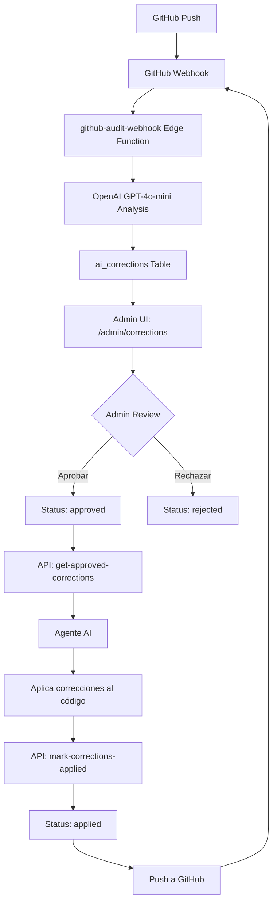

# Sistema de Correcciones Automáticas - Documentación Completa

## 📋 Índice

1. [Visión General](#visión-general)
2. [Arquitectura del Sistema](#arquitectura-del-sistema)
3. [Componentes Principales](#componentes-principales)
4. [Flujo Completo](#flujo-completo)
5. [Integración con Agentes AI](#integración-con-agentes-ai)
6. [Guía de Uso Paso a Paso](#guía-de-uso-paso-a-paso)
7. [APIs y Endpoints](#apis-y-endpoints)
8. [Base de Datos](#base-de-datos)
9. [Troubleshooting](#troubleshooting)
10. [Mejores Prácticas](#mejores-prácticas)

---

## 🎯 Visión General

El **Sistema de Correcciones Automáticas** es una solución integral que permite detectar, revisar y aplicar correcciones de código de forma automatizada mediante inteligencia artificial. El sistema está diseñado para ser agnóstico del agente AI que lo use, permitiendo integración con Lovable, Replit, Claude, GPT, Cursor, o cualquier otro agente personalizado.

### Características Principales

- ✅ **Detección automática** de problemas mediante análisis de OpenAI
- ✅ **Revisión manual** por administradores con sistema de aprobación/rechazo
- ✅ **Aplicación automática** de correcciones por cualquier agente AI
- ✅ **Trazabilidad completa** con logs AAHGPA
- ✅ **Auditoría integrada** con GitHub webhooks
- ✅ **Sistema flexible** que soporta múltiples agentes AI

---

## 🏗️ Arquitectura del Sistema



### Componentes del Sistema

| Componente | Tipo | Descripción |
|------------|------|-------------|
| `github-audit-webhook` | Edge Function | Recibe push events de GitHub y analiza cambios |
| `get-approved-corrections` | Edge Function | API pública para obtener correcciones aprobadas |
| `mark-corrections-applied` | Edge Function | API para marcar correcciones como aplicadas |
| `ai_corrections` | Tabla Supabase | Almacena todas las correcciones detectadas |
| `github_audit_logs` | Tabla Supabase | Logs de auditoría de GitHub |
| `AdminCorrections.tsx` | Componente React | UI de administración de correcciones |

---

## 🔧 Componentes Principales

### 1. GitHub Webhook (`github-audit-webhook`)

**Ubicación:** `supabase/functions/github-audit-webhook/index.ts`

**Función:**
- Recibe eventos `push` de GitHub
- Descarga archivos modificados del commit
- Envía código a OpenAI GPT-4o-mini para análisis
- Guarda correcciones detectadas en `ai_corrections`

**Configuración en GitHub:**
```
URL: https://ghbksqyioendvispcseu.supabase.co/functions/v1/github-audit-webhook
Content-Type: application/json
Events: push
Secret: [GITHUB_WEBHOOK_SECRET]
```

**Prompt de Análisis:**
El webhook usa un prompt especializado que instruye a OpenAI para detectar:
- Errores de tipado (uso de `any`, `string` genérico)
- Falta de validación de datos
- Manejo de errores inexistente o incompleto
- Problemas de accesibilidad
- Vulnerabilidades de seguridad

### 2. API de Correcciones Aprobadas

**Endpoint:** `GET /functions/v1/get-approved-corrections`

**Respuesta:**
```json
{
  "total_corrections": 5,
  "instructions_for_ai": "Instrucciones detalladas para el agente AI...",
  "corrections": [
    {
      "correction_id": "uuid-here",
      "severity": "critical",
      "file": "src/pages/AdminCorrections.tsx",
      "line": 164,
      "issue": "Falta de manejo de errores",
      "description": "No se observa un manejo de errores...",
      "current_code": "const { error } = await supabase...",
      "suggested_code": "const { error } = await supabase... if (error) { ... }",
      "notes": "Agregar try-catch",
      "action_required": "Replace the code at line 164"
    }
  ]
}
```

### 3. API de Marcado de Aplicadas

**Endpoint:** `POST /functions/v1/mark-corrections-applied`

**Request Body:**
```json
{
  "correction_ids": ["uuid-1", "uuid-2", "uuid-3"]
}
```

**Response:**
```json
{
  "success": true,
  "applied_count": 3,
  "corrections": [
    { "id": "uuid-1", "file_path": "src/...", "issue_title": "..." }
  ]
}
```

### 4. UI de Administración

**Ruta:** `/admin/corrections`

**Funcionalidades:**
- Ver correcciones por estado (pendientes, aprobadas, rechazadas, aplicadas)
- Aprobar/rechazar correcciones individualmente
- Aprobar/rechazar todas las pendientes
- Copiar comando para aplicar correcciones
- Ver detalles de código antes/después
- Agregar notas del administrador

---

## 🔄 Flujo Completo

### Fase 1: Detección Automática

```
1. Developer hace push a GitHub
   ↓
2. GitHub envía webhook event a Supabase
   ↓
3. Edge function descarga archivos modificados
   ↓
4. OpenAI GPT-4o-mini analiza el código
   ↓
5. Correcciones guardadas en ai_corrections con status "pending"
```

### Fase 2: Revisión Manual

```
1. Admin accede a /admin/corrections
   ↓
2. Ve correcciones pendientes con detalles
   ↓
3. Revisa cada corrección:
   - Código actual vs sugerido
   - Severidad (critical, important, suggestion)
   - Descripción del problema
   ↓
4. Decide:
   - APROBAR → Status "approved"
   - RECHAZAR → Status "rejected"
   ↓
5. Opcionalmente agrega notas
```

### Fase 3: Aplicación Automática

```
1. Admin presiona "Copiar Comando para Aplicar X Correcciones"
   ↓
2. Comando copiado al portapapeles
   ↓
3. Admin pega comando en chat del Agente AI (Lovable, Replit, etc.)
   ↓
4. Agente AI:
   a. Llama GET /get-approved-corrections
   b. Lee cada corrección
   c. Aplica cambios usando sus herramientas (lov-line-replace, etc.)
   d. Llama POST /mark-corrections-applied con IDs
   ↓
5. Correcciones marcadas como "applied"
   ↓
6. Cambios pusheados a GitHub
   ↓
7. Nuevo webhook event → Ciclo se repite
```

---

## 🤖 Integración con Agentes AI

El sistema está diseñado para trabajar con **cualquier agente AI** que pueda:
1. Hacer llamadas HTTP
2. Leer/modificar archivos
3. Ejecutar comandos

### Lovable AI (Este Chat)

**Comando para aplicar correcciones:**
```
Aplica automáticamente las X correcciones aprobadas. Lee la API GET /functions/v1/get-approved-corrections, aplica cada corrección al código usando lov-line-replace, y marca como aplicadas llamando a POST /functions/v1/mark-corrections-applied con los IDs.
```

**Proceso interno de Lovable:**
1. Llama a `supabase--curl_edge_functions` para GET
2. Parsea JSON de correcciones
3. Usa `lov-line-replace` para cada corrección
4. Llama a `supabase--curl_edge_functions` para POST

### Replit AI

**Código de ejemplo:**
```python
import requests

# 1. Obtener correcciones
response = requests.get("https://ghbksqyioendvispcseu.supabase.co/functions/v1/get-approved-corrections")
corrections = response.json()

applied_ids = []
for correction in corrections['corrections']:
    file_path = correction['file']
    
    # 2. Leer archivo
    with open(file_path, 'r') as f:
        content = f.read()
    
    # 3. Aplicar corrección
    content = content.replace(
        correction['current_code'], 
        correction['suggested_code']
    )
    
    # 4. Escribir archivo
    with open(file_path, 'w') as f:
        f.write(content)
    
    applied_ids.append(correction['correction_id'])

# 5. Marcar como aplicadas
requests.post(
    "https://ghbksqyioendvispcseu.supabase.co/functions/v1/mark-corrections-applied",
    json={"correction_ids": applied_ids}
)
```

### Claude AI / GPT-4 / ChatGPT

**Prompt para el agente:**
```
Necesito que actúes como un agente de corrección de código.

1. Llama a esta API:
   GET https://ghbksqyioendvispcseu.supabase.co/functions/v1/get-approved-corrections

2. Lee cada corrección en el JSON devuelto

3. Para cada corrección:
   - Abre el archivo en 'file'
   - Busca 'current_code'
   - Reemplaza con 'suggested_code'

4. Marca como aplicadas:
   POST https://ghbksqyioendvispcseu.supabase.co/functions/v1/mark-corrections-applied
   Body: { "correction_ids": ["id1", "id2", ...] }

5. Confirma cuántas aplicaste
```

### Cursor AI

**Configuración en .cursorrules:**
```javascript
async function applyCorrections() {
  const response = await fetch(
    'https://ghbksqyioendvispcseu.supabase.co/functions/v1/get-approved-corrections'
  );
  const data = await response.json();
  
  const appliedIds = [];
  
  for (const correction of data.corrections) {
    // Aplicar corrección usando API de Cursor
    // ... implementación específica de Cursor
    
    appliedIds.push(correction.correction_id);
  }
  
  await fetch(
    'https://ghbksqyioendvispcseu.supabase.co/functions/v1/mark-corrections-applied',
    {
      method: 'POST',
      headers: { 'Content-Type': 'application/json' },
      body: JSON.stringify({ correction_ids: appliedIds })
    }
  );
}
```

---

## 📖 Guía de Uso Paso a Paso

### Para Administradores

#### 1. Revisar Correcciones Nuevas

1. Navega a `/admin/corrections`
2. Verás tabs: **Pendientes**, **Aprobadas**, **Rechazadas**, **Aplicadas**
3. Las correcciones nuevas aparecen en **Pendientes**

#### 2. Aprobar una Corrección

1. Click en el botón **"Aprobar"** de la corrección
2. Se abre un diálogo con:
   - Título de la corrección
   - Código actual vs sugerido
   - Campo de notas (opcional, máx 1000 caracteres)
3. Agrega notas si es necesario
4. Click en **"Aprobar"** en el diálogo
5. La corrección se mueve a **Aprobadas (X)**

#### 3. Aplicar Correcciones Aprobadas

1. Cuando tengas correcciones en **Aprobadas**
2. Click en el botón rojo **"Copiar Comando para Aplicar X Correcciones"**
3. Verás un toast: "✅ Comando copiado al portapapeles"
4. Abre el chat de Lovable (o tu agente AI preferido)
5. Pega el comando (Ctrl+V / Cmd+V)
6. Envía el mensaje
7. El agente aplicará las correcciones automáticamente
8. Las correcciones se marcan como **Aplicadas**

#### 4. Aprobar/Rechazar Todas

- **Aprobar Todas:** Click en "Aprobar Todas (X)" para aprobar todas las pendientes
- **Rechazar Todas:** Click en "Rechazar Todas" para rechazar todas las pendientes

#### 5. Copiar Correcciones

- Click en **"Copiar Todas"** para copiar todas las correcciones pendientes en formato Markdown

### Para Desarrolladores

#### 1. Configurar GitHub Webhook

```bash
# 1. Ir a GitHub repo → Settings → Webhooks → Add webhook
# 2. Configurar:
#    - Payload URL: https://ghbksqyioendvispcseu.supabase.co/functions/v1/github-audit-webhook
#    - Content type: application/json
#    - Secret: [Tu GITHUB_WEBHOOK_SECRET de Supabase]
#    - Events: Just the push event
#    - Active: ✓
```

#### 2. Trabajar con Correcciones

```bash
# 1. Haz cambios en el código
git add .
git commit -m "feat: implementar nueva feature"
git push origin main

# 2. El webhook automáticamente:
#    - Detecta el push
#    - Analiza los cambios
#    - Crea correcciones en /admin/corrections

# 3. El admin revisa y aprueba

# 4. Aplicar correcciones:
#    - Admin copia comando
#    - Pega en Lovable chat
#    - Correcciones se aplican automáticamente
```

---

## 🔌 APIs y Endpoints

### Base URL
```
https://ghbksqyioendvispcseu.supabase.co/functions/v1
```

### Endpoints Disponibles

| Endpoint | Método | Auth | Descripción |
|----------|--------|------|-------------|
| `/github-audit-webhook` | POST | ❌ | Recibe webhooks de GitHub |
| `/get-approved-corrections` | GET | ❌ | Obtiene correcciones aprobadas |
| `/mark-corrections-applied` | POST | ❌ | Marca correcciones como aplicadas |

### Detalles de APIs

#### GET /get-approved-corrections

**Query Parameters:** Ninguno

**Response Schema:**
```typescript
interface CorrectionsResponse {
  total_corrections: number;
  instructions_for_ai: string;
  corrections: Array<{
    correction_id: string;
    severity: "critical" | "important" | "suggestion";
    file: string;
    line: number | null;
    issue: string;
    description: string;
    current_code: string | null;
    suggested_code: string | null;
    notes: string | null;
    action_required: string;
  }>;
}
```

**Ejemplo de uso:**
```bash
curl -X GET https://ghbksqyioendvispcseu.supabase.co/functions/v1/get-approved-corrections
```

#### POST /mark-corrections-applied

**Request Schema:**
```typescript
interface MarkAppliedRequest {
  correction_ids: string[];
}
```

**Response Schema:**
```typescript
interface MarkAppliedResponse {
  success: boolean;
  applied_count: number;
  corrections: Array<{
    id: string;
    file_path: string;
    issue_title: string;
  }>;
}
```

**Ejemplo de uso:**
```bash
curl -X POST https://ghbksqyioendvispcseu.supabase.co/functions/v1/mark-corrections-applied \
  -H "Content-Type: application/json" \
  -d '{"correction_ids": ["uuid-1", "uuid-2"]}'
```

---

## 🗄️ Base de Datos

### Tabla: `ai_corrections`

**Columnas:**

| Columna | Tipo | Nullable | Descripción |
|---------|------|----------|-------------|
| `id` | uuid | No | Primary key |
| `audit_log_id` | uuid | No | FK a github_audit_logs |
| `severity` | text | No | "critical", "important", "suggestion" |
| `file_path` | text | No | Ruta del archivo |
| `line_number` | integer | Yes | Línea del código |
| `issue_title` | text | No | Título del problema |
| `issue_description` | text | No | Descripción detallada |
| `code_before` | text | Yes | Código actual |
| `code_after` | text | Yes | Código sugerido |
| `status` | text | No | "pending", "approved", "rejected", "applied" |
| `admin_notes` | text | Yes | Notas del admin (máx 1000 chars) |
| `reviewed_by` | uuid | Yes | ID del admin que revisó |
| `reviewed_at` | timestamptz | Yes | Fecha de revisión |
| `applied_at` | timestamptz | Yes | Fecha de aplicación |
| `created_at` | timestamptz | Yes | Fecha de creación |
| `updated_at` | timestamptz | Yes | Última actualización |

**Índices:**
- `idx_corrections_status`: Índice en `status` para queries rápidas
- `idx_corrections_audit_log`: Índice en `audit_log_id`

**RLS Policies:**
- Admins pueden ver todas las correcciones
- Admins pueden actualizar correcciones
- Admins pueden eliminar correcciones
- Service role puede insertar correcciones

### Tabla: `github_audit_logs`

**Columnas:**

| Columna | Tipo | Nullable | Descripción |
|---------|------|----------|-------------|
| `id` | uuid | No | Primary key |
| `event_type` | text | No | Tipo de evento GitHub |
| `repository` | text | No | Nombre del repositorio |
| `branch` | text | Yes | Branch afectada |
| `commit_sha` | text | Yes | SHA del commit |
| `commit_message` | text | Yes | Mensaje del commit |
| `workflow_name` | text | No | Nombre del workflow |
| `workflow_run_id` | text | Yes | ID del workflow run |
| `status` | text | No | "processing", "completed", "failed" |
| `audit_data` | jsonb | No | Datos del evento |
| `ai_analysis` | jsonb | Yes | Análisis de OpenAI |
| `findings_summary` | jsonb | Yes | Resumen de hallazgos |
| `received_at` | timestamptz | No | Fecha de recepción |
| `created_at` | timestamptz | No | Fecha de creación |

---

## 🔍 Troubleshooting

### Problema: No se reciben correcciones nuevas

**Síntomas:**
- Haces push a GitHub pero no aparecen correcciones en `/admin/corrections`

**Diagnóstico:**
1. Verifica que el webhook está configurado en GitHub
2. Revisa los logs del webhook:
   ```bash
   # En Supabase dashboard → Functions → github-audit-webhook → Logs
   ```
3. Verifica que `GITHUB_WEBHOOK_SECRET` está configurado correctamente

**Solución:**
```bash
# 1. Verifica el webhook en GitHub
# Settings → Webhooks → [Tu webhook] → Recent Deliveries

# 2. Si hay errores 500, revisa los logs de Supabase
# 3. Si hay errores de autenticación, regenera el secret
```

### Problema: Correcciones no se aplican automáticamente

**Síntomas:**
- Apruebas correcciones y presionas "Aplicar" pero no se modifican los archivos

**Diagnóstico:**
1. Verifica que copiaste y pegaste el comando en el chat
2. Verifica que el agente AI tiene acceso a las APIs públicas

**Solución:**
```bash
# 1. Prueba la API manualmente
curl https://ghbksqyioendvispcseu.supabase.co/functions/v1/get-approved-corrections

# 2. Si devuelve correcciones, el problema es el agente AI
# 3. Si no devuelve correcciones, verifica la base de datos:
SELECT COUNT(*) FROM ai_corrections WHERE status = 'approved';
```

### Problema: Errores de validación en notas

**Síntomas:**
- Al aprobar con notas, aparece error "Las notas contienen errores"

**Causa:**
- Las notas exceden 1000 caracteres

**Solución:**
- Reduce el tamaño de las notas o divide en múltiples correcciones

### Problema: Correcciones duplicadas

**Síntomas:**
- La misma corrección aparece varias veces

**Causa:**
- El webhook se disparó múltiples veces para el mismo commit

**Solución:**
```sql
-- Eliminar correcciones duplicadas
DELETE FROM ai_corrections
WHERE id IN (
  SELECT id FROM (
    SELECT id, ROW_NUMBER() OVER (
      PARTITION BY file_path, issue_title, created_at::date 
      ORDER BY created_at DESC
    ) as rn
    FROM ai_corrections
  ) t
  WHERE t.rn > 1
);
```

---

## ✅ Mejores Prácticas

### Para Administradores

1. **Revisar todas las correcciones críticas primero**
   - Ordena por severidad: críticas → importantes → sugerencias

2. **Agregar notas descriptivas**
   - Explica por qué aprobaste o rechazaste
   - Ayuda al equipo a entender el contexto

3. **Aplicar correcciones en batches pequeños**
   - No apliques más de 20 correcciones a la vez
   - Facilita el debugging si algo sale mal

4. **Verificar el código después de aplicar**
   - Revisa que las correcciones se aplicaron correctamente
   - Testea la aplicación antes del siguiente push

### Para Desarrolladores

1. **Escribir mensajes de commit descriptivos**
   - El análisis AI usa los mensajes para contexto
   - Ejemplo: `fix: corregir validación de email en formulario de registro`

2. **Hacer commits pequeños y atómicos**
   - Facilita el análisis de correcciones
   - Ejemplo: 1 feature = 1 commit

3. **Revisar correcciones periódicamente**
   - No dejes acumular correcciones pendientes
   - Ideal: revisar cada 2-3 commits

4. **Documentar decisiones de rechazo**
   - Si rechazas una corrección, explica por qué
   - Ayuda a mejorar el prompt de análisis

### Para Agentes AI

1. **Validar antes de aplicar**
   - Lee el contexto completo del archivo
   - Verifica que el cambio tiene sentido

2. **Aplicar en orden de severidad**
   - Críticas primero, sugerencias al final

3. **Manejar errores gracefully**
   - Si una corrección falla, continúa con las demás
   - Reporta qué falló y por qué

4. **Marcar solo las aplicadas exitosamente**
   - No marques como aplicadas las que fallaron

---

## 📊 Métricas y KPIs

### Métricas del Sistema

```sql
-- Correcciones por estado
SELECT status, COUNT(*) as count 
FROM ai_corrections 
GROUP BY status;

-- Correcciones por severidad
SELECT severity, COUNT(*) as count 
FROM ai_corrections 
GROUP BY severity;

-- Tasa de aprobación
SELECT 
  (COUNT(*) FILTER (WHERE status = 'approved')::float / 
   COUNT(*) FILTER (WHERE status IN ('approved', 'rejected'))::float * 100) as approval_rate
FROM ai_corrections;

-- Tiempo promedio de revisión
SELECT AVG(reviewed_at - created_at) as avg_review_time
FROM ai_corrections
WHERE reviewed_at IS NOT NULL;

-- Tiempo promedio de aplicación
SELECT AVG(applied_at - reviewed_at) as avg_application_time
FROM ai_corrections
WHERE applied_at IS NOT NULL;
```

### Dashboard Sugerido

Puedes crear un dashboard con:
- **Correcciones por día** (gráfico de líneas)
- **Distribución por severidad** (gráfico de pastel)
- **Tasa de aprobación** (número grande)
- **Tiempo promedio de revisión** (número grande)
- **Top 5 archivos con más correcciones** (tabla)

---

## 🔐 Seguridad

### Validación de Input

Todas las notas del admin se validan con Zod:
```typescript
const adminNotesSchema = z.string()
  .max(1000, "Las notas no pueden exceder 1000 caracteres")
  .trim()
  .optional();
```

### RLS Policies

Solo admins pueden:
- Ver correcciones
- Aprobar/rechazar correcciones
- Eliminar correcciones

El service role puede:
- Insertar correcciones (desde webhook)

### APIs Públicas

Las APIs `/get-approved-corrections` y `/mark-corrections-applied` son públicas (`verify_jwt = false`) para permitir acceso desde cualquier agente AI.

**⚠️ Recomendación para producción:**
- Implementar autenticación con API key
- Rate limiting por IP
- Logging de todas las llamadas

---

## 🚀 Roadmap Futuro

### Features Planeados

1. **Dashboard de métricas**
   - Gráficos de correcciones por tiempo
   - Análisis de tendencias
   - Reportes exportables

2. **Notificaciones automáticas**
   - Email al admin cuando hay correcciones nuevas
   - Slack/Discord integration
   - Notificaciones push en el navegador

3. **Aprendizaje automático**
   - Mejorar el prompt de análisis basado en historial
   - Predecir qué correcciones serán aprobadas
   - Sugerir mejoras al prompt

4. **Integración con CI/CD**
   - Bloquear merges si hay correcciones críticas
   - Generar PR comments con correcciones
   - Auto-merge de correcciones aprobadas

5. **Soporte para más lenguajes**
   - Python, Java, Go, Rust
   - Análisis específico por lenguaje
   - Reglas personalizadas

---

## 📞 Soporte

Si tienes problemas o preguntas:

1. **Revisa la documentación** en `docs/`
2. **Busca en los logs** de Supabase
3. **Verifica la base de datos** con las queries de troubleshooting
4. **Consulta la documentación de integración** en `docs/AI_AGENT_INTEGRATION.md`

---

## 📄 Licencia

Este sistema es parte del proyecto principal y sigue la misma licencia.

---

**Última actualización:** 2025-11-17  
**Versión:** 1.0.0  
**Autor:** Sistema de Correcciones Automáticas Wincova
